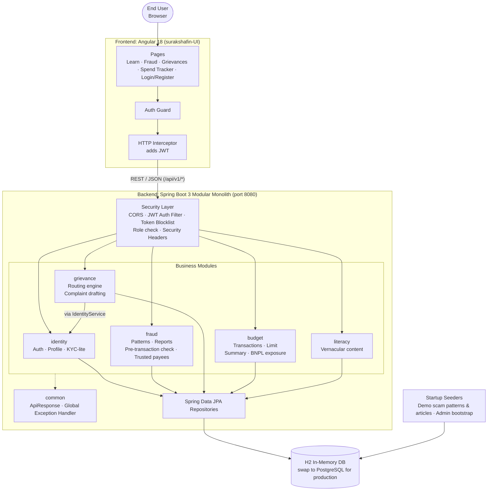
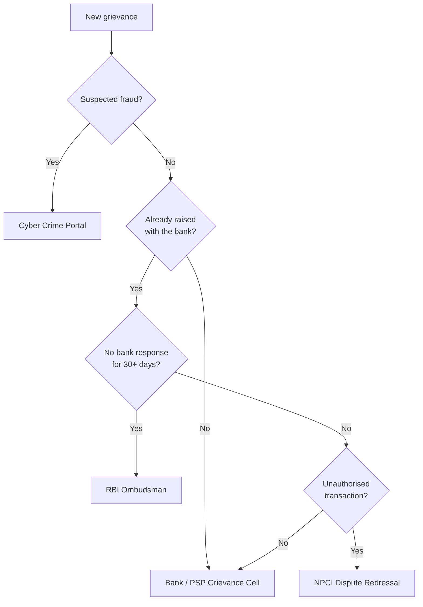
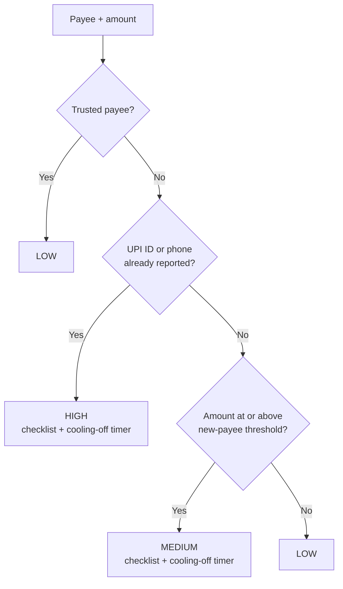

# SuRakshaFin

A consumer fintech safety platform that helps everyday users **spot scams, get their complaints to the right authority, keep their spending in check, and learn safe digital-money habits** — all in one place.

---

## a) What is this Application all about?

SuRakshaFin ("Suraksha" means *protection* in Hindi) is a full-stack web application for people who use UPI, mobile banking and Buy-Now-Pay-Later (BNPL) every day but have no easy way to protect themselves when something goes wrong.

It brings four everyday needs together under one login:

| Module | What it does for the user |
|---|---|
| **Fraud Protection** | Browse a library of known scam patterns, report a fraud in one tap, check a payee *before* sending money, and keep a list of trusted payees. |
| **Grievance Router** | Answer a few questions and the app works out *who* should receive your complaint (Bank, NPCI, Cyber Crime Portal or RBI Ombudsman) and drafts the complaint letter for you. |
| **Spend Tracker** | Log spends, set a monthly budget, and get plain-language nudges, a category breakdown and your total BNPL exposure. |
| **Literacy Hub** | Short, readable articles on UPI safety, BNPL risks, mule accounts and your grievance rights. Open to everyone, no login needed. |

Alongside these, the app has secure sign-up and login (phone + password), a lightweight KYC (PAN) step, password recovery, and a minimal admin role for moving fraud reports and grievances through their review lifecycle.

---

## b) Why is this Application different from other applications?

Most finance apps either *track money* or *move money*. SuRakshaFin focuses on what happens **around** the money — before a payment goes wrong, and after.

- **Protection before payment, not just reporting after.** The pre-transaction check looks at the payee and the amount and returns a `LOW` / `MEDIUM` / `HIGH` risk level with reasons, a short safety checklist and a cooling-off timer. A payee already reported as a suspect by other users is flagged `HIGH`; a large first-time payment to someone not on your trusted list is flagged `MEDIUM`.
- **Community-powered fraud intelligence.** Reports submitted by users feed the same check that protects the next user, and scam patterns can be confirmed by the community to show which ones are still active.
- **It tells you *where* to complain, and writes the complaint.** Instead of leaving users to guess between the bank, NPCI, the cyber cell or the RBI Ombudsman, a routing engine decides based on simple facts (suspected fraud? already raised with the bank? no reply in 30 days? unauthorised transaction?) and generates a ready-to-send complaint letter. Complaints that pass the 30-day mark are flagged as due for escalation.
- **BNPL visibility.** The budget summary separates out BNPL spending so users can see how much they owe in "pay later" commitments.
- **Education built into the product.** Safety content sits next to the tools in the same app, and the content API is language-aware (`?language=` and `?topic=`), so it can be extended to regional languages.
- **Security-first defaults.** No hardcoded secrets (the app refuses to start without a strong JWT secret), BCrypt password hashing, login lockout, server-side token revocation on logout, security response headers, and developer tools (H2 console, Swagger) switched off unless explicitly enabled.
- **Built to grow.** The backend is a *modular monolith* with strict package boundaries, so any module can later be split into its own microservice without rewriting business logic.

---

## c) Application Stack

### Backend — `/` (project root)

| Area | Technology |
|---|---|
| Language / Runtime | Java 17 |
| Framework | Spring Boot 3.3.2 (Spring Web, Spring Data JPA, Spring Validation) |
| Security | Spring Security, JWT (JJWT 0.12.6), BCrypt password hashing |
| Database | H2 in-memory (demo); the JPA code can run on PostgreSQL by changing the datasource in `application.yml` |
| API docs | springdoc-openapi / Swagger UI 2.6.0 (dev only) |
| Build | Maven |
| Utilities | Lombok |
| Testing | Spring Boot Test, Spring Security Test |

### Frontend — `/surakshafin-UI`

| Area | Technology |
|---|---|
| Framework | Angular 18 (standalone components, lazy-loaded routes) |
| Language | TypeScript 5.5 |
| Reactive layer | RxJS 7 |
| Auth | Route guard + HTTP interceptor that attaches the JWT |
| Dev proxy | `/api` is proxied to `http://localhost:8080` |

### Backend modules (Java packages)

| Package | Responsibility |
|---|---|
| `identity` | Registration, login, logout, password reset, profile, KYC-lite |
| `fraud` | Scam patterns, fraud reports, pre-transaction check, trusted payees |
| `grievance` | Routing engine, complaint drafting, grievance lifecycle |
| `budget` | Transactions, monthly limit, spend summary and nudges |
| `literacy` | Multi-language educational content |
| `config` | Security, JWT, token blocklist, OpenAPI, data seeders |
| `common` | Shared API response wrapper and exception handling |

Modules talk to each other **only through their `*Service` classes**, never through another module's repository or entity.

---

## d) Application Architecture



### Request flow in short

1. The user opens the Angular app; protected pages (Fraud, Grievances, Spend Tracker) are guarded by a login check.
2. The interceptor adds the JWT to every `/api/` call.
3. On the backend, the security layer validates the token (and checks it has not been revoked), applies CORS rules and role checks (admin-only endpoints), then passes the call to the right module.
4. The module's service applies the business rules and reads or writes data through JPA.
5. Every response is returned in a common `ApiResponse` wrapper; unexpected errors are logged server-side and returned to the client as a generic message.

### Grievance routing logic



### Pre-transaction risk check



---

## e) Why is this Application helpful for end users?

- **Fewer people lose money to scams.** A clear warning with reasons, a safety checklist and a short pause appear at the exact moment a mistake is most likely — right before the payment is confirmed.
- **No more "who do I complain to?"** Users get a clear answer and a ready-made, properly addressed complaint letter, which saves time and lowers the barrier to actually filing.
- **Knowing your rights.** The app shows when a complaint can be escalated (for example, after 30 days without a bank response), so users are not stuck waiting.
- **Control over spending.** Simple budget nudges in plain language and a clear view of BNPL dues help users avoid slipping into debt unnoticed.
- **Learn while you use it.** Short safety articles on UPI, BNPL, mule accounts and grievance rights are free and available without signing in.
- **Safe with personal data.** Strong password rules, lockout after repeated failed logins, token revocation on logout and no secrets in code keep accounts protected.
- **One place for it all.** Fraud help, complaint filing, budgeting and learning live in a single, simple app instead of being scattered across bank apps, government portals and websites.

---

## Quick Start

**Requirements:** Java 17+, Maven, Node.js 18+ (for the UI)

### Backend

```bash
export SURAKSHAFIN_JWT_SECRET=$(openssl rand -hex 32)
mvn spring-boot:run
```

Runs on `http://localhost:8080`. Optional environment variables:

| Variable | Purpose |
|---|---|
| `SURAKSHAFIN_JWT_SECRET` | **Required.** JWT signing secret (32+ bytes). |
| `SURAKSHAFIN_DEV_TOOLS_ENABLED` | `true` enables Swagger UI (`/docs`) and the H2 console for local development. |
| `SURAKSHAFIN_CORS_ORIGINS` | Allowed frontend origin(s). Defaults to `http://localhost:*`. |
| `SURAKSHAFIN_ADMIN_PHONE` / `SURAKSHAFIN_ADMIN_PASSWORD` | Optional: creates the first admin account at startup. |

### Frontend

```bash
cd surakshafin-UI
npm install
npm start
```

Runs on `http://localhost:4200` and proxies `/api` calls to the backend.

---

## License

See the [LICENSE](LICENSE) file.
